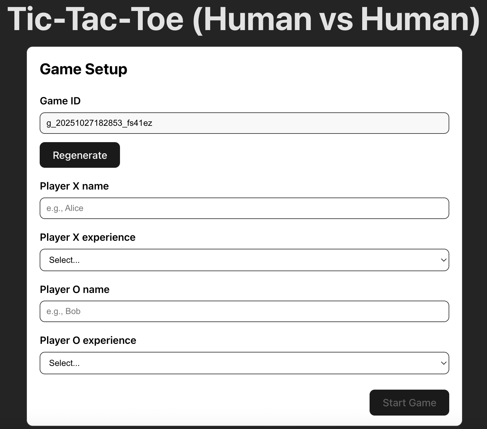
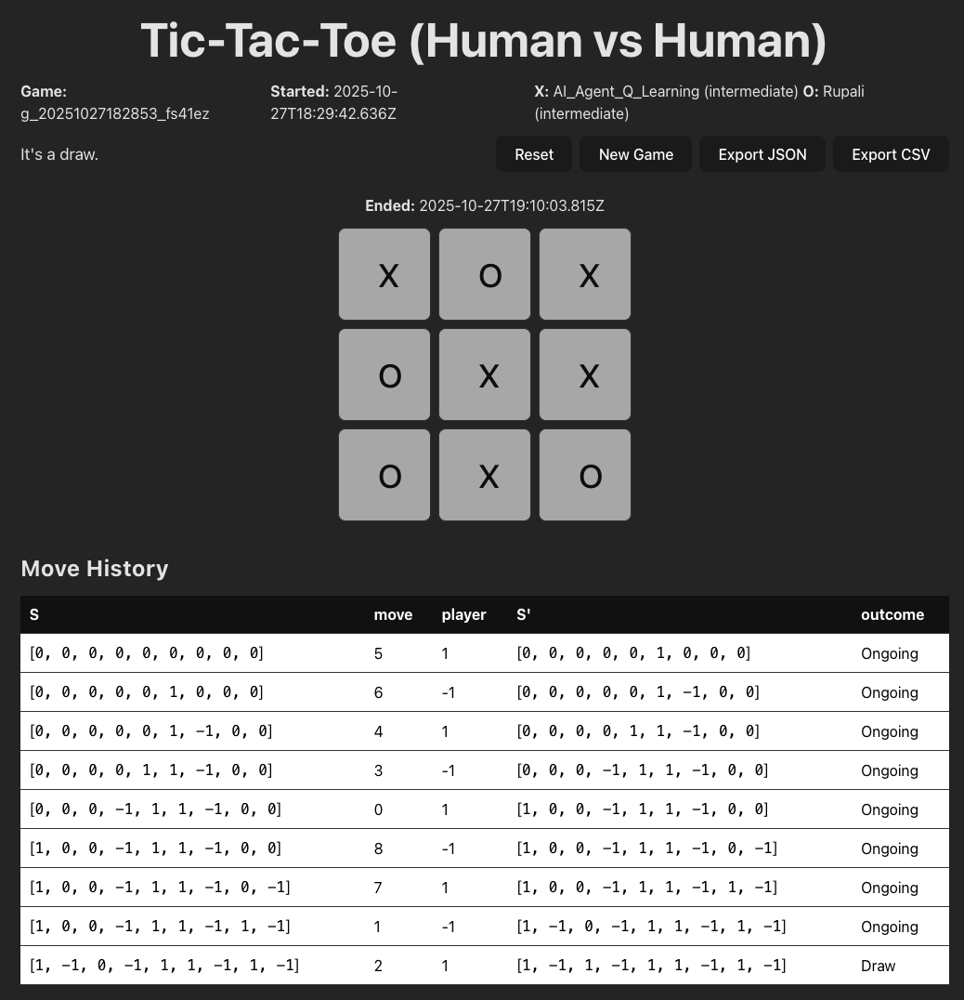

Mingyi Li and Rupali Bhati

CS 7250 Fall 2025 Final Project

### Motivation

##### Artificial Intelligence (AI) agents are now achieving superhuman performance in many games. The strategies developed by such agents can be used to help human players improve their strategies. Moreover, interactive visualisation tools can help users understand complex AI strategies.
To support this, we designed a recommendation-based visualization tool that board-game players and researchers can use while they are playing the game. The tool highlights both AI-generated and human strategies, where the AI-generated strategy is a pre-trained algorithm, while the human strategy is the most probable human move based on the collected data. Visualising both the AI agent and human strategies on the same board makes it easier for the user to understand and compare how different players—human or artificial—approach the game. We demonstrate the tool using Tic-Tac-Toe, a simple and highly interpretable setting that allows users to clearly see how the recommendations work. 

### Data

#### Existing Datasets

##### For the task of studying Tic-Tac-Toe moves, we found two publicly available datasets:
###### - [Tic-Tac-Toe Endgame Data Set](https://www.kaggle.com/datasets/rsrishav/tictactoe-endgame-data-set): This dataset contains information about multiple games. Each row in the dataset contains the final configuration of the board as well as labels of win and loss. The columns in this dataset are the 9 positions of the board and a final column of win/loss/draw. However, this dataset does not contain information about moves at each step of the game and, therefore, is not suitable for our analysis.
##### - [Tic-Tac-Toe Machine Learning dataset](https://www.kaggle.com/datasets/fabdelja/tictactoe/data): In this dataset, for each game, all moves made by the players are recorded along with the final result of the game (win/lost/draw). The columns show moves 1 to 7 and a final column indicating a win/loss/draw. However, the description of this dataset is incomplete. According to the description of the dataset, the game terminates after 3 up to 9 moves. However, the Tic-Tac-Toe game requires at least 5 moves for it to terminate (3 from the winner and 2 from the loser). Moreover, this dataset only contains 7 moves, whereas there are a total of 9 moves in the game of Tic-Tac-Toe. Therefore, this dataset is not suitable for our analysis.

##### This renders us in a position to collect our own dataset. We have created a game engine as explained below. 

#### Human Data

##### We built a [Tic-Tac-Toe website](https://tic-tac-toe-d1b97.web.app/) to collect data. This website was created using React and TypeScript.
In the   a game ID is generated for each game. Moreover, we ask the players to enter their names and their experience levels to aggregate over players and experience levels. In  , we show one game. In the top half of the figure, we see the game being played. In the lower half, we show a table preview of the actual data that we are logging. Each row is a move from the player. The columns of the table indicate the current state of the board as ``S", the move played by a player as ``move", the player who played this move as ``player", the next state of the board as ``S", and finally the outcome of the game as ``outcome" that can take the values of ``win", ``loss" or ``draw". You may notice that there aren't any ``X's" and ``O's" in the table. For data analysis purposes, we indicate each place on the board as a number. For example, an X is represented as 1, an empty space is represented as 0, and an O is represented as -1. The move of each player is the number of the cell on the Tic-Tac-Toe board. These numbers begin from the top left corner, starting with 0, and span across each row before moving to the next row. The move history on the interface displays only part of the data that we collected and uploaded to the database.

#### AI Data

### Task Analysis

#### Interview Findings

#### Domain Task Analysis

### Design Process

#### Design Sketches

#### Usability Testing

### Final Visualization

#### Visual Encoding

#### User Interface

#### Implementation

### Data Analysis

### Conclusion
